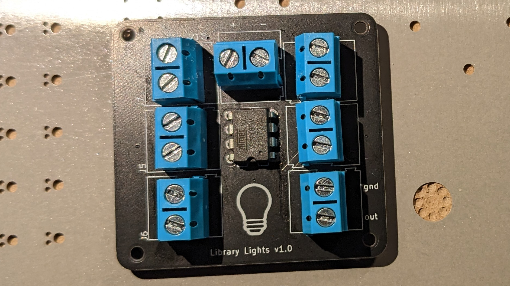
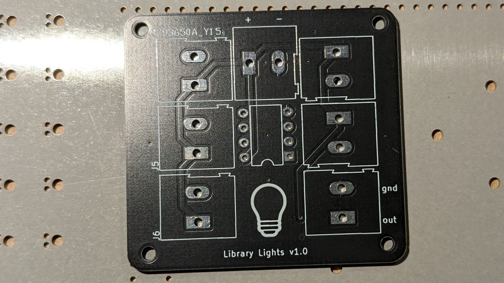
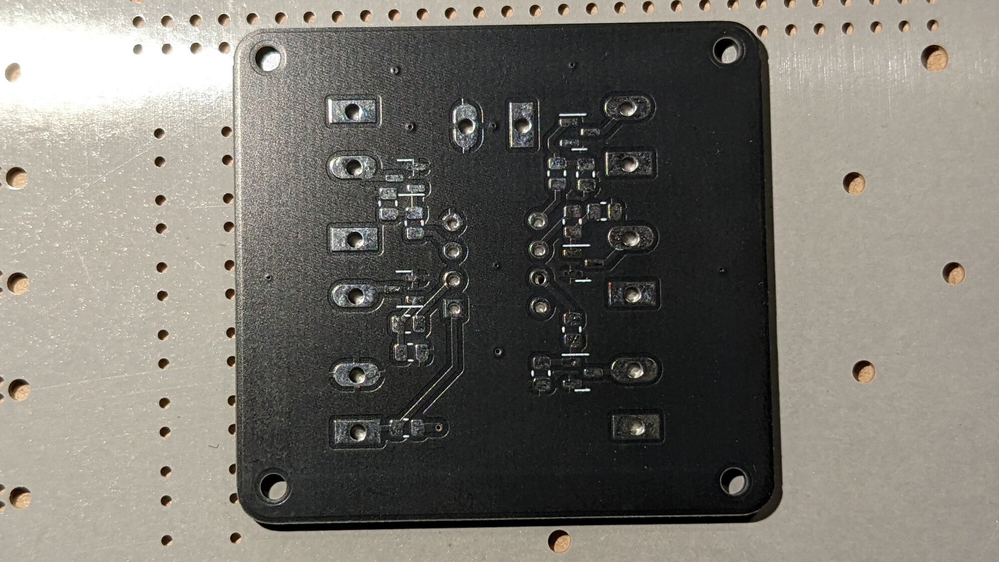

# Lending Library Lighting Controller 

 

This simple controller based off of an ATTINY85 was designed to control lights within a lending library. It may be simple but it works. 

# Images

*Top of the board*
<picture>

</picture>

*Bottom of the board*

